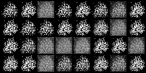
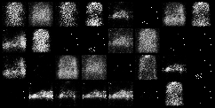
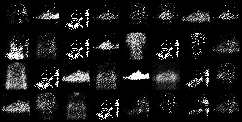
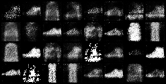
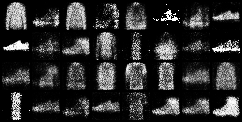

<p align="center">
  <h1 align="center">🧠 Deep Learning Image Generation</h1>
  <p align="center">
    A unified deep learning project exploring <strong>CNN</strong>, <strong>RNN</strong>, and <strong>GAN</strong> architectures<br/>
    for image classification, sentiment analysis, and image generation.
  </p>
  <p align="center">
    <strong>Author:</strong> Eshaan V S
  </p>
</p>

---

<p align="center">
  
  
  
  
  
</p>

---

## 📋 Table of Contents

- [Overview](#-overview)
- [Project Structure](#-project-structure)
- [Part 1: CNN – Image Classification](#-part-1-cnn--image-classification)
- [Part 2: RNN – Sentiment Analysis](#-part-2-rnn--sentiment-analysis)
- [Part 3: DCGAN – Image Generation](#-part-3-dcgan--image-generation)
- [Getting Started](#-getting-started)
- [Outputs](#-outputs)
- [Key Findings](#-key-findings)
- [Tech Stack](#-tech-stack)
- [Author](#-author)

---

## 🔍 Overview

This project provides a hands-on exploration of three core deep learning paradigms, all within a single Jupyter Notebook:

| # | Architecture | Dataset | Task | Key Result |
|:-:|:------------|:--------|:-----|:-----------|
| 1 | **CNN** (SimpleCNN + ResNet18) | CIFAR-10 | Image Classification | **70.89%** accuracy |
| 2 | **RNN / LSTM / GRU** | IMDB Reviews | Sentiment Analysis | **0.344** loss (GRU) |
| 3 | **DCGAN** | CIFAR-10 | Image Generation | 20-epoch training |

### Pipeline
```
Data Loading → Preprocessing → Model Training → Evaluation → Visualization
```

---

## 📁 Project Structure

```
deep-learning-image-generation/
│
├── cnn_rnn_gan_project.ipynb    # 📓 Main notebook — all implementations
├── README.md                     # 📖 Project documentation (this file)
├── REPORT.md                     # 📊 Detailed analysis report
│
└── output/                       # 🖼️ GAN-generated image samples
    ├── epoch_1.png
    ├── epoch_5.png
    ├── epoch_10.png
    ├── epoch_15.png
    └── epoch_20.png
```

---

## 🖼️ Part 1: CNN – Image Classification

### Models
| Model | Description |
|:------|:-----------|
| **SimpleCNN** | Custom 3-layer CNN — Conv2d → BatchNorm → ReLU → MaxPool → FC + Dropout |
| **ResNet18** | Pretrained on ImageNet — frozen backbone, retrained FC layer for 10 classes |

### Results
| Model | Test Accuracy | Train Loss (Epoch 3) | Val Loss (Epoch 3) |
|:------|:------------:|:--------------------:|:-------------------:|
| SimpleCNN | **70.89%** | 0.887 | 0.859 |
| ResNet18 (frozen) | ~42% | 1.585 | 1.610 |

### Visualizations
- 📈 Training vs Validation Loss curves
- 📊 Confusion Matrix (SimpleCNN)

---

## 📝 Part 2: RNN – Sentiment Analysis

### Architecture
A flexible `TextModel` class supporting three RNN variants:

```
Embedding(10000, 64) → [RNN | LSTM | GRU](64, 64) → Linear(64, 1) → Sigmoid
```

### Results (3 Epochs)
| Model | Epoch 1 | Epoch 2 | Epoch 3 |
|:------|:-------:|:-------:|:-------:|
| RNN   | 0.649 | 0.580 | 0.516 |
| LSTM  | 0.610 | 0.475 | 0.365 |
| **GRU** | 0.629 | 0.452 | **0.344** |

> 💡 Gated architectures (LSTM/GRU) significantly outperform vanilla RNN, confirming their superior ability to capture long-range dependencies.

---

## 🎨 Part 3: DCGAN – Image Generation

### Architecture

| Component | Description |
|:----------|:-----------|
| **Generator** | `z(100)` → ConvTranspose2d × 4 → BatchNorm + ReLU → `3×32×32` (Tanh) |
| **Discriminator** | `3×32×32` → Conv2d × 4 → LeakyReLU(0.2) + Dropout(0.3) → Sigmoid |

### Training Configuration
| Parameter | Value |
|:----------|:------|
| Epochs | 20 |
| Optimizer | Adam (lr=0.0002, β₁=0.5, β₂=0.999) |
| Loss | Binary Cross-Entropy |
| Latent Dim | 100 |

### Training Progress
| Epoch | D Loss | G Loss |
|:-----:|:------:|:------:|
| 1 | 0.049 | 12.636 |
| 5 | 0.522 | 4.017 |
| 10 | 0.201 | 5.900 |
| 15 | 0.855 | 2.915 |
| 20 | 0.763 | 4.616 |

> Generated samples are saved at each epoch in `output/`. Images progressively improve from random noise to recognizable patterns.

### 🖼️ Generated Samples

<table>
  <tr>
    <td align="center"><strong>Epoch 1</strong><br/></td>
    <td align="center"><strong>Epoch 5</strong><br/></td>
    <td align="center"><strong>Epoch 10</strong><br/></td>
  </tr>
  <tr>
    <td align="center"><strong>Epoch 15</strong><br/></td>
    <td align="center"><strong>Epoch 20</strong><br/></td>
    <td align="center"></td>
  </tr>
</table>

---

## 🚀 Getting Started

### Prerequisites
- Python 3.8+
- Jupyter Notebook / JupyterLab / Google Colab
- GPU recommended (tested on NVIDIA T4)

### Quick Start (Google Colab — Recommended)
1. Open [Google Colab](https://colab.research.google.com/)
2. Upload `cnn_rnn_gan_project.ipynb`
3. Set runtime to **T4 GPU** → `Runtime → Change runtime type`
4. Run all cells sequentially

### Local Setup
```bash
# Clone the repository
git clone https://github.com/Manvith1411/deep-learning-image-generation.git
cd deep-learning-image-generation

# Create virtual environment
python -m venv .venv
source .venv/bin/activate        # macOS/Linux
# .venv\Scripts\Activate.ps1     # Windows PowerShell

# Install dependencies
pip install torch torchvision scikit-learn matplotlib seaborn tensorflow

# Launch notebook
jupyter notebook
```

---

## 📸 Outputs

Generated image samples from the DCGAN training process (saved in `output/`):

| Stage | File | Preview |
|:------|:-----|:-------:|
| Early | `epoch_1.png` — Initial noise |  |
| Preliminary | `epoch_5.png` — Structure forming |  |
| Intermediate | `epoch_10.png` — Patterns emerge |  |
| Advanced | `epoch_15.png` — Improved quality |  |
| Final | `epoch_20.png` — Best results |  |

---

## 🔑 Key Findings

| # | Finding |
|:-:|:--------|
| 1 | **CNNs** — Even simple architectures achieve ~71% accuracy on CIFAR-10. Transfer learning with frozen backbones may underperform when pretraining data (ImageNet) differs significantly from the target domain. |
| 2 | **RNNs** — Gated architectures (LSTM/GRU) consistently outperform vanilla RNN for sequence modeling, demonstrating superior handling of vanishing gradient problems. |
| 3 | **GANs** — DCGAN produces recognizable but noisy images after 20 epochs. Higher quality requires more training, larger models, and techniques like progressive growing or attention mechanisms. |

### 💡 Tips for Improvement
- 🔓 **Unfreeze** ResNet18 backbone layers for better transfer learning on CIFAR-10
- 📈 **Increase GAN training** to 100+ epochs for sharper generated images
- 🎯 **Set random seeds** for reproducibility across experiments
- ⚡ **Enable GPU acceleration** for significantly faster training

---

## 🛠️ Tech Stack

| Category | Technologies |
|:---------|:------------|
| **Language** |  |
| **Deep Learning** |   |
| **Data Science** |   |
| **Visualization** |   |
| **Datasets** |   |
| **Platform** |  |
| **Hardware** |  |
| **Environment** |  |

### Dependencies
```
torch              # Core deep learning framework
torchvision        # Vision datasets, models, transforms
tensorflow         # IMDB dataset loading (keras.datasets)
numpy              # Numerical computing
matplotlib         # Plotting and visualization
scikit-learn       # Evaluation metrics (confusion matrix)
seaborn            # Statistical visualization
```

---

## 👤 Author

**Eshaan V S**

---

<p align="center">
  <em>Built with ❤️ using PyTorch & TensorFlow</em>
</p>
